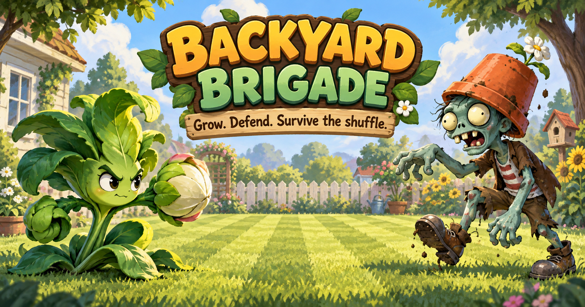

# Backyard Brigade



Backyard Brigade is a browser-based lane-defense game set in a cartoon version of our family front yard. Build a defense across a 5 × 9 lawn, collect falling sun, and survive three waves of shamblers with a growing roster of custom plants.

## Play the game

**Live game:** [backyard-brigade.three2333.chatgpt.site](https://backyard-brigade.three2333.chatgpt.site/)

The game runs entirely in the browser. Music may begin after the first click or key press because browsers block autoplay until the player interacts with the page.

## Gameplay

- Spend sun to place plants on the 5 × 9 lawn.
- Projectile plants automatically attack zombies in their lane after the zombies enter the playable lawn.
- Collect falling sun tokens to fund more plants.
- Each lane has a one-use lawn mower as its last line of defense.
- Clear all three waves to secure the yard.

### Plants

| Plant | Cost | Health | Role |
| --- | ---: | ---: | --- |
| Sprout Scout | 100 | 100 | Fires one fast pea for 25 damage. |
| Stone Shooter | 125 | 150 | Fires two rocks per volley, each dealing 22 damage. |
| Stone Plant | 150 | 125 | Swallows the nearest zombie in range, then digests for 5 seconds. |
| Watermelon Plant | 200 | 250 | Fires two watermelon slices, each dealing 37.5 damage (1.5× pea damage). |

### Zombies and waves

| Enemy | Base health | Speed | Behavior |
| --- | ---: | ---: | --- |
| Pothead Shambler | 125 | 100% | Walks down a lane and bites plants on contact. |
| Log Zombie | 250 | 80% | Appears from wave 2 and swings its log at plants. |

Each wave contains 12 Pothead Shamblers. Wave 2 adds 5 Log Zombies, and wave 3 adds 7, for 48 enemies across the full game. Later spawns receive a small health increase.

## Controls

| Input | Action |
| --- | --- |
| `1`–`4` | Select a plant card |
| Click a plant card | Select or deselect that plant |
| Click a lawn tile | Place the selected plant |
| Click a sun token | Collect sun |
| `Esc` | Clear the current plant selection |
| `Space` | Pause or resume |
| `R` | Restart after winning or losing |
| Music button | Mute or resume the background music |

## Tech architecture

The project is a client-side React and TypeScript game organized with the Next.js App Router conventions and run through Vinext/Vite. It is packaged for an OpenAI Sites/Cloudflare-compatible deployment.

```text
app/
├── game/
│   ├── Game.tsx       # Game clock, simulation, input, waves, combat, and rendering
│   ├── catalog.ts     # Data-driven plant and zombie definitions
│   └── types.ts       # Definition and entity contracts
├── globals.css        # Board layout, responsive UI, and character animations
├── layout.tsx         # Page metadata and document shell
└── page.tsx           # Game entry point
public/
└── assets/             # Yard, character, animation-frame, and music assets
```

The simulation uses a 50 ms game tick. Runtime entities are stored as React state, while character balance and asset paths live in registries so new plants and zombies can be added without duplicating UI code. Plant behaviors use a discriminated `attackMode` (`projectile` or `devour`), and projectiles carry their own damage, speed, and visual kind.

For a deeper design overview and extension notes, see [GAME_ARCHITECTURE.md](GAME_ARCHITECTURE.md).

## Run locally

### Requirements

- Node.js 22.13.0 or newer
- npm

### Development

```bash
git clone https://github.com/ipadthree/plantvsZombie.git
cd plantvsZombie
npm install
npm run dev
```

Open the local URL printed in the terminal. The development server supports hot reloading.

### Production build

```bash
npm run build
npm run start
```

Run the project checks with:

```bash
npm run lint
```

## Add custom characters

1. Add the transparent character artwork to `public/assets/`.
2. Add its ID and data contract to `app/game/types.ts`.
3. Register its stats, behavior, and asset paths in `app/game/catalog.ts`.
4. Add the plant to the seed bar or the zombie to the wave configuration in `app/game/Game.tsx`.
5. Add CSS only when the character needs a new size, anchor, projectile, or animation treatment.

The artwork and audio included here are project assets for this family game; this repository does not grant a separate license for their reuse.
